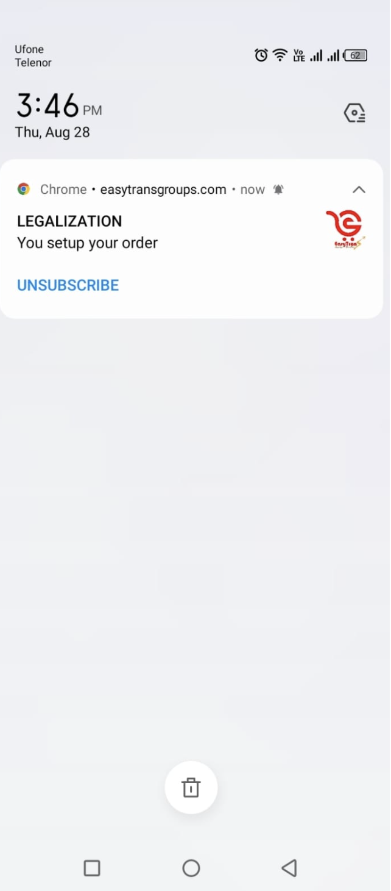
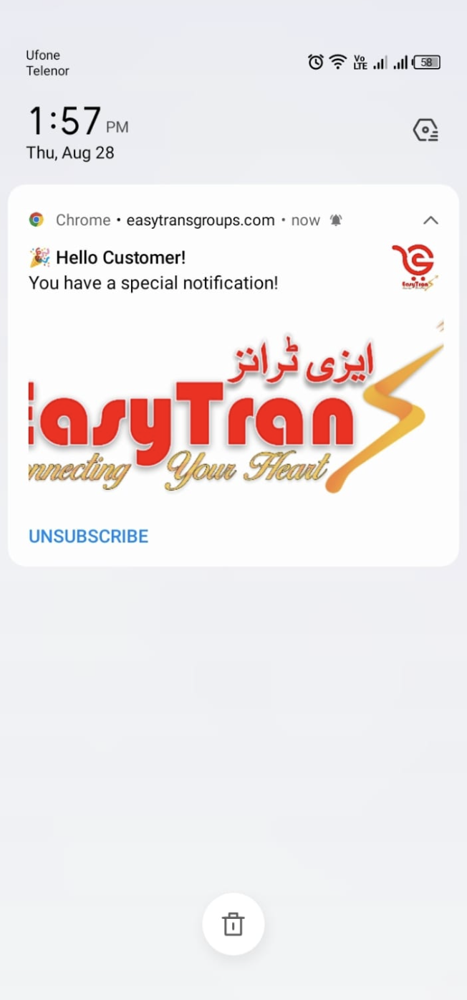

# Laravel FCM Push Notification

This is a Laravel application integrated with **Firebase Cloud Messaging (FCM)** to send and receive push notifications.  

---

## 📌 Features

- 🔑 User FCM token registration  
- 📲 Send push notifications via Firebase  
- ⚡ Example API endpoints for saving tokens and sending notifications  
- 🛠️ Laravel + Firebase integration setup  

---

## 📱 Mobile Push Notification

## 📱 Mobile Push Notification

<p align="center">
  
  
</p>


## 🚀 Getting Started

Follow these steps to run the project locally:

### 1️⃣ Clone the repository
```sh
git clone https://github.com/hameed-fu/laravel-fcm-push-notification.git
cd laravel-fcm-push-notification
